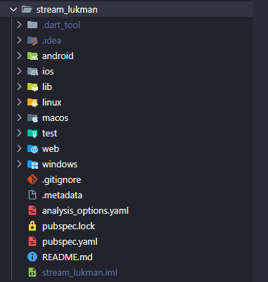

# Nama  : Lukman Eka Septiawan
# Kelas : TI-3C

## Praktikum 1: Dart Streams
### Langkah 1: Buat Project Baru
    Buatlah sebuah project flutter baru dengan nama stream_nama (beri nama panggilan Anda) di folder week-13/src/ repository GitHub Anda.



### Langkah 2: Buka file main.dart
    Ketiklah kode seperti berikut ini

```dart
import 'package:flutter/material.dart';

void main() {
  runApp(const MyApp());
}

class MyApp extends StatelessWidget {
  const MyApp({super.key});

  @override
  Widget build(BuildContext context) {
    return MaterialApp(
      title: 'Stream Lukman',
      theme: ThemeData(
        primaryColor: Colors.deepPurple
      ),
      home: const StreamHomePage(),
    );
  }
}

class StreamHomePage extends StatefulWidget {
  const StreamHomePage({super.key});

  @override
  State<StreamHomePage> createState() => _StreamHomePageState();
}

class _StreamHomePageState extends State<StreamHomePage> {
  @override
  Widget build(BuildContext context) {
    return Container();
  }
}

```

> 1. Task
> - Tambahkan nama panggilan Anda pada title app sebagai identitas hasil pekerjaan Anda.
> - Gantilah warna tema aplikasi sesuai kesukaan Anda.
> - Lakukan commit hasil jawaban Soal 1 dengan pesan "W13: Jawaban Soal 1"

```dart
class MyApp extends StatelessWidget {
  const MyApp({super.key});

  @override
  Widget build(BuildContext context) {
    return MaterialApp(
      title: 'Stream Lukman',
      theme: ThemeData(
        primaryColor: Colors.blueAccent,
      ),
      home: const StreamHomePage(),
    );
  }
}
```

### Langkah 3: Buat file baru stream.dart
    Buat file baru di folder lib project Anda. Lalu isi dengan kode berikut.

```dart
import 'package:flutter/material.dart';

class ColorStream {
  
}
```

### Langkah 4: Tambah variabel colors
    Tambahkan variabel di dalam class ColorStream seperti berikut.
    
```dart
import 'package:flutter/material.dart';

class ColorStream {
  final List<Color> colors = [
    Colors.blueGrey,
    Colors.amber,
    Colors.deepPurple,
    Colors.lightBlue,
    Colors.teal,
  ];
}
```
> 2. Task
> - Tambahkan 5 warna lainnya sesuai keinginan Anda pada variabel colors tersebut.
> - Lakukan commit hasil jawaban Soal 2 dengan pesan "W13: Jawaban Soal 2"

```dart
final List<Color> colors = [
    Colors.blueGrey,
    Colors.amber,
    Colors.deepPurple,
    Colors.lightBlue,
    Colors.teal,
    Colors.pinkAccent,
    Colors.blueAccent,
    Colors.greenAccent,
    Colors.redAccent,
    Colors.orangeAccent,
];
```

### Langkah 5: Tambah method getColors()
    Di dalam class ColorStream ketik method seperti kode berikut. Perhatikan tanda bintang di akhir keyword async* (ini digunakan untuk melakukan Stream data)

```dart
import 'package:flutter/material.dart';

class ColorStream {
  final List<Color> colors = [
    Colors.blueGrey,
    Colors.amber,
    Colors.deepPurple,
    Colors.lightBlue,
    Colors.teal,
    Colors.pinkAccent,
    Colors.blueAccent,
    Colors.greenAccent,
    Colors.redAccent,
    Colors.orangeAccent,
  ];

  Stream<Color> getColors() async* {
 
  }
}
```

### Langkah 6: Tambah perintah yield*
    Tambahkan kode berikut ini.

```dart
Stream<Color> getColors() async* {
    yield* Stream.periodic(
        const Duration(seconds: 1), (int t) {
        int index = t % colors.length;
        return colors[index];
        }
    );
}
```

> 3. Task
> - Jelaskan fungsi keyword yield* pada kode tersebut!
> - Apa maksud isi perintah kode tersebut?
> - Lakukan commit hasil jawaban Soal 3 dengan pesan "W13: Jawaban Soal 3"
> 
>   **Jawaban**: yield* digunakan untuk memungkinkan fungsi colorStream menghasilkan warna yang berubah setiap detiknya berdasarkan warna yang sudah diberikan.

## Langkah 7: Buka main.dart
    Ketik kode impor file ini pada file main.dart

```dart
import 'package:flutter/material.dart';
import 'stream.dart';
```

## Langkah 8: Tambah variabel
    Ketik dua properti ini di dalam class _StreamHomePageState

```dart
class _StreamHomePageState extends State<StreamHomePage> {
  Color bgColor = Colors.blueGrey;
  late ColorStream colorStream;
```

## Langkah 9: Tambah method changeColor()
    Tetap di file main, Ketik kode seperti berikut

```dart
void changeColor(Color color) async {
    await for (var eventColor in colorStream.getColors()) {
        setState(() {
        bgColor = eventColor;
        });
    }
}
```

## Langkah 10: Lakukan override initState()
    Ketika kode seperti berikut

```dart
@override
  void initState() {
    super.initState();
    colorStream = ColorStream();
    changeColor();
  }
```

## Langkah 11: Ubah isi Scaffold()
    Sesuaikan kode seperti berikut.

```dart
Widget build(BuildContext context) {
    return Scaffold(
        appBar: AppBar(
            title: const Text('Stream Lukman'),
        ),
        body: Container(
            decoration: BoxDecoration(color: bgColor),
        ),
    );
}
```

## Langkah 12: Run Project
    Lakukan running pada aplikasi Flutter Anda, maka akan terlihat berubah warna background setiap detik.


> 4. Task
> - Capture hasil praktikum Anda berupa GIF dan lampirkan di README.
> - Lakukan commit hasil jawaban Soal 4 dengan pesan "W13: Jawaban Soal 4"


## Langkah 13: Ganti isi method changeColor()
    Anda boleh comment atau hapus kode sebelumnya, lalu ketika kode seperti berikut.

```dart
void changeColor() async {
    // await for (var eventColor in colorStream.getColors()) {
    //   setState(() {
    //     bgColor = eventColor;
    //   });
    // }

    colorStream.getColors().listen((eventColor) {
      setState(() {
        bgColor = eventColor;
      });
    });
  }
```

> 5. Task
> - Jelaskan perbedaan menggunakan listen dan await for (langkah 9) !
> - Lakukan commit hasil jawaban Soal 5 dengan pesan "W13: Jawaban Soal 5"
>
>   Jawaban: listen digunakan untuk menerima data secara asinkron melalui callback dan tidak memblokir eksekusi kode berikutnya, sedangkah await for berfungsi untuk menunggi data yang diterima dari stream, lalu mengeksekusi kode dengan menunggu sampai ada data baru yang diterima.

> **Catatan** : Stream di Flutter memiliki fitur yang powerfull untuk menangani data secara async. Stream dapat dimanfaatkan pada skenario dunia nyata seperti real-time messaging, unggah dan unduh file, tracking lokasi user, bekerja dengan data sensor IoT, dan lain sebagainya.

## Praktikum 2: Stream controllers dan sinks
`StreamControllers` akan membuat jembatan antara `Stream` dan `Sink`. `Stream` berisi data secara sekuensial yang dapat diterima oleh subscriber manapun, sedangkan `Sink` digunakan untuk mengisi (injeksi) data.

Secara sederhana, StreamControllers merupakan stream management. Ia akan otomatis membuat stream dan sink serta beberapa method untuk melakukan kontrol terhadap event dan fitur-fitur yang ada di dalamnya.

Anda dapat membayangkan stream sebagai pipa air yang mengalir searah, dari salah satu ujung Anda dapat mengisi data dan dari ujung lain data itu keluar.
 
Di Flutter, Anda dapat menggunakan `StreamController` untuk mengontrol aliran data `stream`. Sebuah `StreamController` memiliki sebuah properti bernama sink yang berguna untuk insert data. Sedangkan properti `stream` berguna untuk menerima atau keluarnya data dari `StreamController` tersebut.

### Langkah 1: Buka file stream.dart
    Lakukan impor dengan mengetik kode ini.

```dart
import 'package:flutter/material.dart';
import 'dart:async';
```

### Langkah 2: Tambah class NumberStream
    Tetap di file stream.dart tambah class baru seperti berikut.

```dart
class NumberStream {
  
}
```

### Langkah 3: Tambah StreamController
    Di dalam class NumberStream buatlah variabel seperti berikut.

```dart
class NumberStream {
  final StreamController<int> controller = StreamController<int>();
}
```

### Langkah 4: Tambah method addNumberToSink
    Tetap di class NumberStream buatlah method ini

```dart
class NumberStream {
  final StreamController<int> controller = StreamController<int>();

  void addNumberToSink(int newNumber) {
    controller.sink.add(newNumber);
  }
}
```

### Langkah 5: Tambah method close()

```dart
class NumberStream {
  final StreamController<int> controller = StreamController<int>();

  void addNumberToSink(int newNumber) {
    controller.sink.add(newNumber);
  }

  close() {
    controller.close();
  }
}
```

### Langkah 6: Buka main.dart
    Ketik kode import seperti berikut

```dart
import 'package:flutter/material.dart';
import 'stream.dart';
import 'dart:async';
import 'dart:math';
```

### Langkah 7: Tambah variabel
    Di dalam class _StreamHomePageState ketik variabel berikut

```dart
class _StreamHomePageState extends State<StreamHomePage> {
  Color bgColor = Colors.blueGrey;
  late ColorStream colorStream;
  int lastNumber = 0;
  late StreamController numberStreamController;
  late NumberStream numberStream;
```

### Langkah 8: Edit initState()

```dart
@override
void initState() {
    // super.initState();
    //    colorStream = ColorStream();
    // changeColor();

    numberStream = NumberStream();
    numberStreamController = numberStream.controller;
    Stream stream = numberStreamController.stream;
    stream.listen((event) {
        setState(() {
        lastNumber = event;
        });
    });
}
```

### Langkah 9: Edit dispose()

```dart
@override
void dispose() {
    numberStreamController.close();
    super.dispose();
}
```

### Langkah 10: Tambah method addRandomNumber()

```dart
void addRandomNumber() {
    Random random = Random();
    int myNum = random.nextInt(10);
    numberStream.addNumberToSink(myNum);
}
```

### Langkah 11: Edit method build()

```dart
Widget build(BuildContext context) {
    return Scaffold(
      appBar: AppBar(
        title: const Text('Stream Lukman'),
      ),
      body: SizedBox(
        width: double.infinity,
        child: Column(
          mainAxisAlignment: MainAxisAlignment.spaceEvenly,
          crossAxisAlignment: CrossAxisAlignment.center,
          children: [
            Text(lastNumber.toString()),
            ElevatedButton(
              onPressed: () => addRandomNumber(),
              child: const Text('New Random Number'),
            ),
          ],
        ),
      )
    );
}
```

### Langkah 12: Run Prokect
    Lakukan running pada aplikasi Flutter Anda, maka akan terlihat seperti gambar berikut.


> 6. Task
> - Jelaskan maksud kode langkah 8 dan 10 tersebut!
> - Capture hasil praktikum Anda berupa GIF dan lampirkan di README.
> - Lalu lakukan commit dengan pesan "W13: Jawaban Soal 6".

>   **Jawaban**: kode pada langkah 8 dan 10 digunakan untuk menginisialisasi data number baru. Langkah 8 digunakna untu menginisalisasi numberStrean dan controller yang akan memberikan data. Sedangkah langkah 10 digunakan untuk membuat nilai random yang nantinya diberikan pada objek numberStream menggunakan sink.


## Langkah 13: Buka stream.dart
    Tambahkan method berikut ini.

```dart
addError() {
    controller.sink.addError('Error');
}
```

## Langkah 14: Buka main.dart
    Tambahkan method onError di dalam class StreamHomePageState pada method listen di fungsi initState() seperti berikut ini.

```dart
@override
void initState() {
    // super.initState();
    // colorStream = ColorStream();
    // changeColor();

    numberStream = NumberStream();
    numberStreamController = numberStream.controller;
    Stream stream = numberStreamController.stream;
    stream.listen((event) {
      setState(() {
        lastNumber = event;
      });
    }).onError((error) {
      setState(() {
        lastNumber = -1;
      });
    });
}
```

## Langkah 15: Edit method addRandomNumber()
    Lakukan comment pada dua baris kode berikut, lalu ketik kode seperti berikut ini.

```dart
void addRandomNumber() {
    Random random = Random();
    // int myNum = random.nextInt(10);
    // numberStream.addNumberToSink(myNum);
    numberStream.addError();
}
```

> 7. Task
> - Jelaskan maksud kode langkah 13 sampai 15 tersebut!
> - Kembalikan kode seperti semula pada Langkah 15, comment addError() agar Anda dapat melanjutkan ke praktikum 3 berikutnya.
> - Lalu lakukan commit dengan pesan "W13: Jawaban Soal 7".

>   **Jawaban**: kode yang diterapkan pada langkah 13 hingga 15 digunakan untuk memberikan nilai -1 pada lastNumber ketika terjadi error dalam pengaliran data.

## Praktikum 3: Injeksi data ke streams
Skenario yang umum dilakukan adalah melakukan manipulasi atau transformasi data stream sebelum sampai pada UI end user. Hal ini sangatlah berguna ketika Anda membutuhkan untuk filter data berdasarkan kondisi tertentu, melakukan validasi data, memodifikasinya, atau melakukan proses lain yang memicu beberapa output baru. Contohnya melakukan konversi angka ke string, membuat sebuah perhitungan, atau menghilangkan data yang berulang terus tampil.

Pada praktikum 3 ini, Anda akan menggunakan `StreamTransformers` ke dalam `stream` untuk melakukan `map` dan filter data.

### Langkah 1: Buka main.dart
    Tambahkan variabel baru di dalam class _StreamHomePageState

```dart
class _StreamHomePageState extends State<StreamHomePage> {
  Color bgColor = Colors.blueGrey;
  late ColorStream colorStream;
  int lastNumber = 0;
  late StreamController numberStreamController;
  late NumberStream numberStream;
  late StreamTransformer transformer;
```

### Langkah 2: Tambahkan kode ini di initState

```dart
@override
void initState() {
    // super.initState();
    // colorStream = ColorStream();
    // changeColor();

    numberStream = NumberStream();
    numberStreamController = numberStream.controller;
    Stream stream = numberStreamController.stream;
    
    transformer = StreamTransformer<int, int>.fromHandlers(
      handleData: (value, sink) {
        sink.add(value * 10);
      },
      handleError: (error, stackTrace, sink) {
        sink.add(-1);
      },
      handleDone: (sink) => sink.close(),
    );
    
    stream.listen((event) {
      setState(() {
        lastNumber = event;
      });
    }).onError((error) {
      setState(() {
        lastNumber = -1;
      });
    });
}
```

### Langkah 3: Tetap di initState
    Lakukan edit seperti kode berikut.

```dart
@override
void initState() {
    // super.initState();
    // colorStream = ColorStream();
    // changeColor();

    numberStream = NumberStream();
    numberStreamController = numberStream.controller;
    Stream stream = numberStreamController.stream;
    
    transformer = StreamTransformer<int, int>.fromHandlers(
      handleData: (value, sink) {
        sink.add(value * 10);
      },
      handleError: (error, stackTrace, sink) {
        sink.add(-1);
      },
      handleDone: (sink) => sink.close(),
    );
    
    stream.transform(transformer).listen((event) {
      setState(() {
        lastNumber = event;
      });
    }).onError((error) {
      setState(() {
        lastNumber = -1;
      });
    });
    super.initState();
}
```

### Langkah 4: Run Project
    Terakhir, run atau tekan F5 untuk melihat hasilnya jika memang belum running. Bisa juga lakukan hot restart jika aplikasi sudah running. Maka hasilnya akan seperti gambar berikut ini. Anda akan melihat tampilan angka dari 0 hingga 90.


> 8. Task
> - Jelaskan maksud kode langkah 1-3 tersebut!
> - Capture hasil praktikum Anda berupa GIF dan lampirkan di README.
> - Lalu lakukan commit dengan pesan "W13: Jawaban Soal 8".

>   **Jawaban**: Pada langkah 1 hingga 3 memanfaatkan class StreamTransform untuk mengubah nilai yang akan ditampilkan pada widget. Perubahan tersebut dilakukan sebelum inisialisasi dilakukan pada variabel lastNumber.


## Praktikum 4: Subscribe ke stream events
Dari praktikum sebelumnya, Anda telah menggunakan method `listen` mendapatkan nilai dari `stream`. Ini akan menghasilkan sebuah `Subscription`. `Subscription` berisi method yang dapat digunakan untuk melakukan `listen` pada suatu event dari `stream` secara terstruktur.

Pada praktikum 4 ini, kita akan gunakan `Subscription` untuk menangani event dan error dengan teknik praktik baik (best practice), dan menutup `Subscription` tersebut.

### Langkah 1: Tambah variabel
    Tambahkan variabel berikut di class _StreamHomePageState

```dart
class _StreamHomePageState extends State<StreamHomePage> {
  Color bgColor = Colors.blueGrey;
  late ColorStream colorStream;
  int lastNumber = 0;
  late StreamController numberStreamController;
  late NumberStream numberStream;
  late StreamTransformer transformer;
  late StreamSubscription subscription;
```

### Langkah 2: Edit initState()
    Edit kode seperti berikut ini.

```dart
@override
void initState() {
    // super.initState();
    // colorStream = ColorStream();
    // changeColor();

    numberStream = NumberStream();
    numberStreamController = numberStream.controller;
    Stream stream = numberStreamController.stream;

    // transformer = StreamTransformer<int, int>.fromHandlers(
    //   handleData: (value, sink) {
    //     sink.add(value * 10);
    //   },
    //   handleError: (error, stackTrace, sink) {
    //     sink.add(-1);
    //   },
    //   handleDone: (sink) => sink.close(),
    // );

    // stream.transform(transformer).listen((event) {
    //   setState(() {
    //     lastNumber = event;
    //   });
    // }).onError((error) {
    //   setState(() {
    //     lastNumber = -1;
    //   });
    // });
    // super.initState();
    
    subscription = stream.listen((event) {
      setState(() {
        lastNumber = event;
      });
    });
    super.initState();
}
```

### Langkah 3: Tetap di initState()
    Tambahkan kode berikut ini.

```dart
@override
void initState() {
    // super.initState();
    // colorStream = ColorStream();
    // changeColor();

    numberStream = NumberStream();
    numberStreamController = numberStream.controller;
    Stream stream = numberStreamController.stream;

    // transformer = StreamTransformer<int, int>.fromHandlers(
    //   handleData: (value, sink) {
    //     sink.add(value * 10);
    //   },
    //   handleError: (error, stackTrace, sink) {
    //     sink.add(-1);
    //   },
    //   handleDone: (sink) => sink.close(),
    // );

    // stream.transform(transformer).listen((event) {
    //   setState(() {
    //     lastNumber = event;
    //   });
    // }).onError((error) {
    //   setState(() {
    //     lastNumber = -1;
    //   });
    // });
    // super.initState();
    
    subscription = stream.listen((event) {
      setState(() {
        lastNumber = event;
      });
    });

    subscription.onError((error) {
      setState(() {
        lastNumber = -1;
      });
    });
    super.initState();
}
```

### Langkah 4: Tambah properti onDone()
    Tambahkan dibawahnya kode ini setelah onError

```dart
@override
void initState() {
    // super.initState();
    // colorStream = ColorStream();
    // changeColor();

    numberStream = NumberStream();
    numberStreamController = numberStream.controller;
    Stream stream = numberStreamController.stream;

    // transformer = StreamTransformer<int, int>.fromHandlers(
    //   handleData: (value, sink) {
    //     sink.add(value * 10);
    //   },
    //   handleError: (error, stackTrace, sink) {
    //     sink.add(-1);
    //   },
    //   handleDone: (sink) => sink.close(),
    // );

    // stream.transform(transformer).listen((event) {
    //   setState(() {
    //     lastNumber = event;
    //   });
    // }).onError((error) {
    //   setState(() {
    //     lastNumber = -1;
    //   });
    // });
    // super.initState();
    
    subscription = stream.listen((event) {
      setState(() {
        lastNumber = event;
      });
    });

    subscription.onError((error) {
      setState(() {
        lastNumber = -1;
      });
    });

    subscription.onDone(() {
      print('onDone was called'); 
    });
    super.initState();
}
```

### Langkah 5: Tambah method baru
    Ketik method ini di dalam class _StreamHomePageState

```dart
void stopStream() {
    numberStreamController.close();
}
```

### Langkah 6: Pindah ke method dispose()
    Jika method dispose() belum ada, Anda dapat mengetiknya dan dibuat override. Ketik kode ini didalamnya.

```dart
@override
void dispose() {
    numberStreamController.close();
    subscription.cancel();
    super.dispose();
}
```

### Langkah 7: Pindah ke method build()
    Tambahkan button kedua dengan isi kode seperti berikut ini.

```dart
children: [
    Text(lastNumber.toString()),
    ElevatedButton(
    onPressed: () => stopStream(),
    child: const Text('Stop Subscription'),
    ),
],
```

### Langkah 8: Edit method addRandomNumber()
    Edit kode seperti berikut ini.

```dart
void addRandomNumber() {
    Random random = Random();
    int myNum = random.nextInt(10);
    // numberStream.addNumberToSink(myNum);
    // numberStream.addError();
    if (!numberStreamController.isClosed) {
      numberStream.addNumberToSink(myNum);
    } else {
      setState(() {
        lastNumber = -1;
      });
    }
}
```

### Langkah 9: Run Project
    Anda akan melihat dua button seperti gambar berikut.


### Langkah 10: Tekan button ‘Stop Subscription'
    Anda akan melihat pesan di Debug Console seperti berikut.


> 9. Task
> - Jelaskan maksud kode langkah 2, 6 dan 8 tersebut!
> - Capture hasil praktikum Anda berupa GIF dan lampirkan di README.
> - Lalu lakukan commit dengan pesan "W13: Jawaban Soal 9".

>   **Jawaban**: Kode pada langkah 2 digunakan untuk merekam jalannya data yang diterima oleh event, lalu akan menginisialisasi variabel lastNumber dengan nilai dari event. Kode langkah 6 digunakan untuk membatalkan subscription yang sebelumnya sudah diinisialisasi pada method setState. Kode langkah 8 digunakan untuk memeriksa apakan numberStreaController sudah tertutup atau belum, jika belum makan akan menginisialisasi numberStream dengan data random dan ketika sudah tertutup maka variabel lastNumber akan diinisialisasi dengan nilai -1.


## Praktikum 5: Multiple stream subscriptions
Secara default, stream hanya bisa digunakan untuk satu subscription. Jika Anda mencoba untuk melakukan subscription yang sama lebih dari satu, maka akan terjadi error. Untuk menangani hal itu, tersedia broadcast stream yang dapat digunakan untuk multiple subscriptions. Pada praktikum ini, Anda akan mencoba untuk melakukan multiple stream subscriptions.

### Langkah 1: Buka file main.dart
    Ketik variabel berikut di class _StreamHomePageState

```dart
class _StreamHomePageState extends State<StreamHomePage> {
  Color bgColor = Colors.blueGrey;
  late ColorStream colorStream;
  int lastNumber = 0;
  late StreamController numberStreamController;
  late NumberStream numberStream;
  late StreamTransformer transformer;
  late StreamSubscription subscription;
  late StreamSubscription subscription2;
  String values = '';
```

### Langkah 2: Edit initState()
    Ketik kode seperti berikut.

```dart
subscription = stream.listen((event) {
      setState(() {
        values += '$event - ';
      });
    });
    
subscription2 = stream.listen((event) {
    setState(() {
    values += '$event - ';
    });
});
```

### Langkah 3: Run Project
    Lakukan run maka akan tampil error seperti gambar berikut.


> 10. Task
> - Jelaskan mengapa error itu bisa terjadi ?.

>   **Jawaban**: Error tersebut terjadi karena terdapat 2 stream berjalan bersamaan akan tetapi menggunakan singgle stream, dimana singgle stream (stream) hanya dapat menjalankan 1 stream saja.

### Langkah 4: Set broadcast stream
    Ketik kode seperti berikut di method initState()

```dart
@override
void initState() {
    // super.initState();
    // colorStream = ColorStream();
    // changeColor();

    numberStream = NumberStream();
    numberStreamController = numberStream.controller;
    // Stream stream = numberStreamController.stream;
    Stream stream = numberStreamController.stream.asBroadcastStream();
```

### Langkah 5: Edit method build()
Tambahkan text seperti berikut

```dart
@override
  Widget build(BuildContext context) {
    return Scaffold(
      appBar: AppBar(
        title: const Text('Stream Lukman'),
      ),
      body: SizedBox(
        width: double.infinity,
        child: Column(
          mainAxisAlignment: MainAxisAlignment.spaceEvenly,
          crossAxisAlignment: CrossAxisAlignment.center,
          children: [
            Text(values),
            ElevatedButton(
              onPressed: () => addRandomNumber(),
              child: const Text('New Random Number'),
            ),
            ElevatedButton(
              onPressed: () => stopStream(),
              child: const Text('Stop Subscription'),
            ),
          ],
        ),
      )
    );
  }
}
```

### Langkah 6: Run Project
Tekan button '**New Random Number**' beberapa kali, maka akan tampil teks angka terus bertambah sebanyak dua kali.


> 11. Task
> - Jelaskan mengapa hal itu bisa terjadi ?
> - Capture hasil praktikum Anda berupa GIF dan lampirkan di README.
> - Lalu lakukan commit dengan pesan "W13: Jawaban Soal 10,11".

>   **Jawaban**: Hal tersebut bisa terjadi karena terdapat 2 stream yang memiliki fungsi yang sama berjalan secara bersamaan. Sehingga ketika button **New Random Number** ditekan akan memunculkan 2 angka yang sama.


## Praktikum 6: StreamBuilder
`StreamBuilder` adalah sebuah widget untuk melakukan listen terhadap 
event dari stream. Ketika sebuah event terkirim, maka akan 
dibangun ulang semua turunannya. Seperti halnya widget `FutureBuilder` 
pada pertemuan pekan lalu, `StreamBuilder` berguna untuk membangun UI secara reaktif yang diperbarui 
setiap data baru tersedia.

### Langkah 1: Buat Project Baru
    Buatlah sebuah project flutter baru dengan nama streambuilder_nama (beri nama panggilan Anda) di folder week-13/src/ repository GitHub Anda.


### Langkah 2: Buat file baru stream.dart
    Ketik kode ini

```dart

```
    
### Langkah 3: Tetap di file stream.dart
    Ketik kode seperti berikut.

```dart

```

### Langkah 4: Edit main.dart
    Ketik kode seperti berikut ini.

```dart

```

```dart

```

### Langkah 5: Tambah variabel
    Di dalam `class _StreamHomePageState`, ketika variabel ini.

```dart

```

### Langkah 6: Edit initState()
    Ketik kode seperti berikut.

```dart

```

### Langkah 7: Edit method build()

```dart

```

### Langkah 8: Run Project
    Hasilnya, setiap detik akan tampil angka baru seperti berikut.


> 12. Task
> - Jelaskan maksud kode pada langkah 3 dan 7 !
> - Capture hasil praktikum Anda berupa GIF dan lampirkan di README.
> - Lalu lakukan commit dengan pesan "W13: Jawaban Soal 12".

## Praktikum 7: BLoC Pattern
Ketika menggunakan pola BLoC, maka segalanya merupakan stream event. BLoC atau Business Logic Component adalah lapisan antara semua sumber data dan UI yang mengonsumsi data itu. Contohnya seperti sumber data dari HTTP layanan web servis atau JSON dari sebuah basis data.

Sebuah BLoC menerima stream data dari sumbernya, proses itu membutuhkan logika bisnis Anda, dan return stream data ke subscriber-nya. Perhatikan diagram pola kerja BLoC berikut ini.


Alasan utama menggunakan BLoC adalah memisahkan logika bisnis aplikasi dengan presentasi UI pada widget, terutama akan sangat berguna ketika aplikasi Anda mulai semakin kompleks dan membutuhkan akses state di berbagai tempat. Hal ini akan membuat semakin mudah dalam menggunakan kode Anda, pada beberapa bagian di aplikasi atau bahkan berbeda aplikasi. Selain itu, BLoC secara independen berdiri sendiri dengan UI, sehingga sangat mudah dilakukan isolasi dalam proses testing.

Pada praktikum codelab ini, Anda akan membuat aplikasi sederhana menggunakan BLoC, namun Anda dapat dengan mudah mengembangkannya untuk aplikasi yang lebih besar ruang lingkupnya.

### Langkah 1: Buat Project baru
    Buatlah sebuah project flutter baru dengan nama bloc_random_nama (beri nama panggilan Anda) di folder week-13/src/ repository GitHub Anda. Lalu buat file baru di folder lib dengan nama random_bloc.dart


### Langkah 2: Isi kode random_bloc.dart
    Ketik kode impor berikut ini.

```dart

```

### Langkah 3: Buat class RandomNumberBloc()

```dart

```

### Langkah 4: Buat variabel StreamController
    Di dalam class RandomNumberBloc() ketik variabel berikut ini

```dart

```

### Langkah 5: Buat constructor

```dart

```

### Langkah 6: Buat method dispose()

```dart

```

### Langkah 7: Edit main.dart

```dart

```

### Langkah 8: Buat file baru random_screen.dart
    Di dalam folder lib project Anda, buatlah file baru ini.


### Langkah 9: Lakukan impor material dan random_bloc.dart
    Ketik kode ini di file baru random_screen.dart

```dart

```

### Langkah 10: Buat StatefulWidget RandomScreen
Buatlah di dalam file random_screen.dart


### Langkah 11: Buat variabel
    Ketik kode ini di dalam class _RandomScreenState

```dart

```

### Langkah 12: Buat method dispose()
    Ketik kode ini di dalam class _StreamHomePageState

```dart

```

### Langkah 13: Edit method build()
    Ketik kode ini di dalam class _StreamHomePageState

```dart

```

    Run aplikasi, maka Anda akan melihat angka acak antara angka 0 sampai 9 setiap kali menekan tombol FloactingActionButton.

> 13. Task
> - Jelaskan maksud praktikum ini ! Dimanakah letak konsep pola BLoC-nya ?
> - Capture hasil praktikum Anda berupa GIF dan lampirkan di README.
> - Lalu lakukan commit dengan pesan "W13: Jawaban Soal 13".